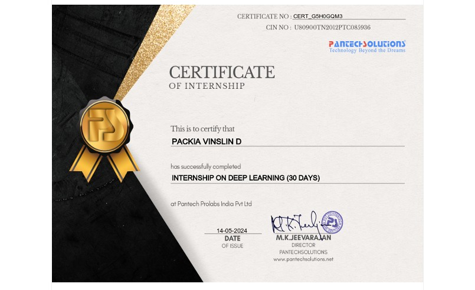
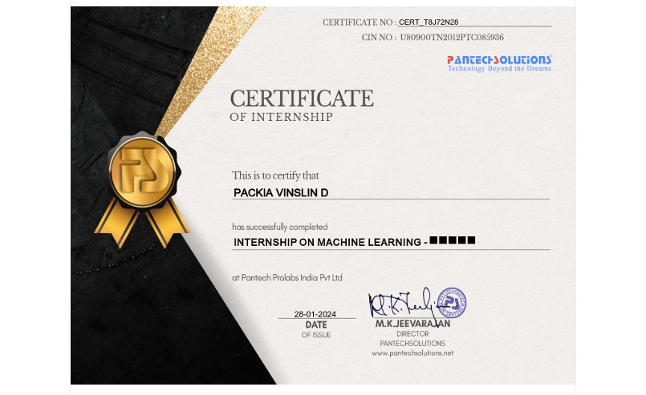
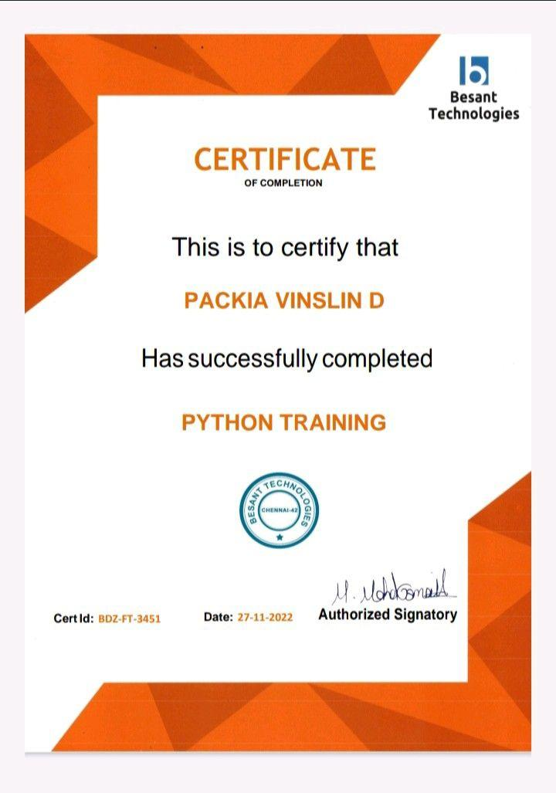
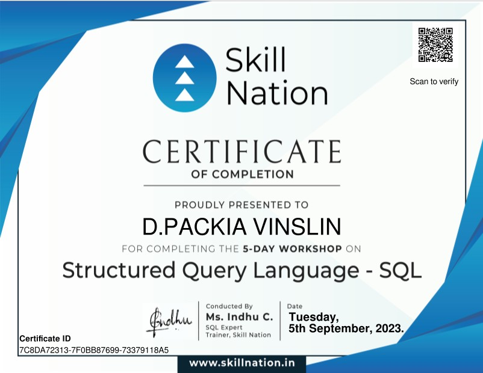
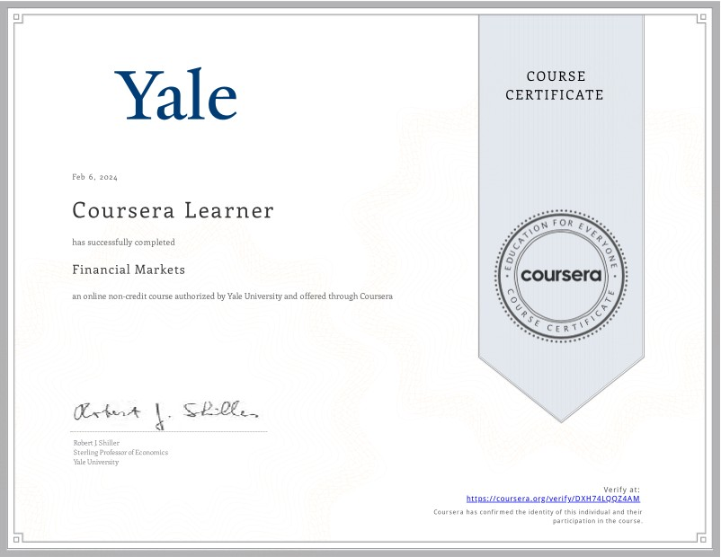

<!-- ─────────────────────────  HERO  ───────────────────────── -->
<h1 align="center">
  
</h1>

<!-- Quick‑glance skill badges -->

---

## 🚀 Overview
Hi there! I’m **Packia Vinslin D** – a machine‑learning buff who blends  
🧠 **AI** ➜ 💰 **Finance** ➜ 💻 **Software** to build real‑world solutions.  
The certifications below chronicle my learning path from **Python basics** to  
**deep neural networks** and the **inner workings of Wall Street**.

> _“Learning never exhausts the mind; it ignites it.”_

---

## 🌟 What these credentials mean to me

| 🔍 Focus | ✨ Why it matters in my journey |
| :--- | :--- |
| **Programming Fluency** | Python is my main toolkit for data pipelines, automation & rapid prototyping. |
| **Data Mastery (SQL)** | Clean, well‑queried data = better ML models & insights. |
| **ML & DL Internships** | Hands‑on experience building, tuning & shipping models that matter. |
| **Financial Literacy** | Understanding markets helps me craft AI that bridges tech with fintech. |

---

## 📜 Certifications (click to expand)

🧠 <strong>Internship on Deep Learning (30 Days)</strong> &nbsp;· Pantech Solutions &nbsp;· 14 May 2024

**Highlights**

* Designed & trained **CNNs, RNNs, Auto‑encoders** with TensorFlow/Keras.  
* Tackled real‑world datasets: image‑based defect detection, text sentiment.  
* Practised **hyper‑parameter tuning, overfitting control & model explainability**.

 

🤖 <strong>Internship on Machine Learning</strong> &nbsp;· Pantech Solutions &nbsp;· 28 Jan 2024

**Highlights**

* End‑to‑end ML pipeline: data wrangling → feature engineering → deployment.  
* Built **classification & regression** models with scikit‑learn.  
* Explored **model performance metrics** and **CI/CD for ML**.

 

🐍 <strong>Python Programming</strong> &nbsp;· Besant Technologies &nbsp;· 27 Nov 2022

**Highlights**

* Core Python, OOP, file I/O & error handling.  
* Libraries: **NumPy, Pandas, Matplotlib**.  
* Automated mini‑projects and data preprocessing scripts.

 

🧾 <strong>Structured Query Language (SQL)</strong> &nbsp;· Skill Nation &nbsp;· 5 Sep 2023

**Highlights**

* CRUD, joins, sub‑queries, views, indexing & basic optimisation.  
* Translated raw tables into tidy datasets for ML ingestion.  
* Built dashboards on top of relational data.

 

💰 <strong>Financial Markets</strong> &nbsp;· Yale University (Coursera) &nbsp;· 6 Feb 2024

**Taught by Nobel laureate <em>Prof. Robert J. Shiller</em>**

* Risk management, diversification, derivatives & behavioural finance.  
* Explored how **AI can interpret and forecast** market behaviour.  
* Sparked my interest in **fintech innovation & algorithmic trading**.

---

