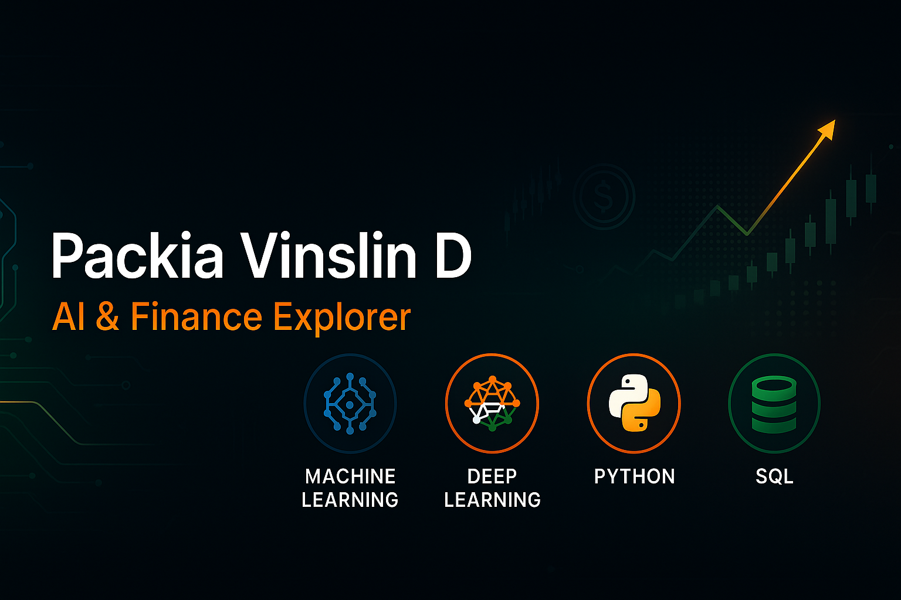

<!-- ─────────────────────────────  HERO BANNER  ───────────────────────────── -->
<h1 align="center">
  
</h1>

<!-- Quick skill tags -->

---

## 🚀 About Me

Hello! I’m **Packia Vinslin D**, a passionate AI learner on a mission to bridge **artificial intelligence with real-world finance**.

My journey began with basic Python scripts and evolved into building ML pipelines, diving into neural networks, and finally understanding how the **stock market behaves** through courses taught by Nobel laureates.

> _“Learning never exhausts the mind; it ignites it.”_

---

## 🌐 My Learning Journey

---

### 🧠 Deep Learning Internship (30 Days)  
**Institution**: Pantech Solutions  
**Date**: May 14, 2024  

This internship helped me break into the neural space. I worked on:

- Designing CNNs and RNNs using **Keras and TensorFlow**
- Hyperparameter tuning, dropout layers, and model regularization
- Real-world use cases: **image-based defect detection**, **sentiment analysis**

  

---

### 🤖 Machine Learning Internship  
**Institution**: Pantech Solutions  
**Date**: Jan 28, 2024  

From data to deployment, this course walked me through:

- **Data cleaning**, **feature engineering**, and building pipelines  
- Building ML models like **decision trees**, **SVMs**, and **KNN**  
- Understanding evaluation metrics like **F1-score** and **AUC-ROC**

  

---

### 🐍 Python Programming  
**Institution**: Besant Technologies  
**Date**: Nov 27, 2022  

The foundation of everything I do in AI was built here:

- Variables, conditionals, loops, **OOP**, file I/O, error handling  
- Libraries I use today: **NumPy, Pandas, Matplotlib**  
- Developed small automation tools & data pipelines

  

---

### 🧾 Structured Query Language (SQL)  
**Institution**: Skill Nation  
**Date**: Sep 5, 2023  

Mastering SQL made me more fluent in **data preparation**:

- Queries, joins, subqueries, views, and indexing  
- Using SQL as a foundation for **data wrangling** in ML  
- Converted raw messy data into clean, ML-ready formats

  

---

### 💰 Financial Markets  
**Institution**: Yale University via Coursera  
**Instructor**: Nobel Laureate Prof. Robert J. Shiller  
**Date**: Feb 6, 2024  

This course was a game-changer. I learned:

- Basics of **risk, diversification, stocks, bonds, derivatives**  
- Behavioral economics: why markets react the way they do  
- How AI can assist in **market forecasting and trading**

  

---

## 🧩 What It All Means

| 💡 Skill Area | 🧠 Takeaway |
| :------------ | :---------- |
| **Programming Fluency** | Python became my daily driver for data tasks, analysis, and automation. |
| **Data Mastery (SQL)** | Querying like a pro helps me build better ML inputs. |
| **Model Building** | My internships helped me bring theory into working solutions. |
| **Finance + AI** | I'm now exploring how models can help decode and predict market trends. |

---

## 🙌 Let’s Connect

If you're into **AI, fintech, ed-tech**, or just love building things that matter — let's connect!

  

  

